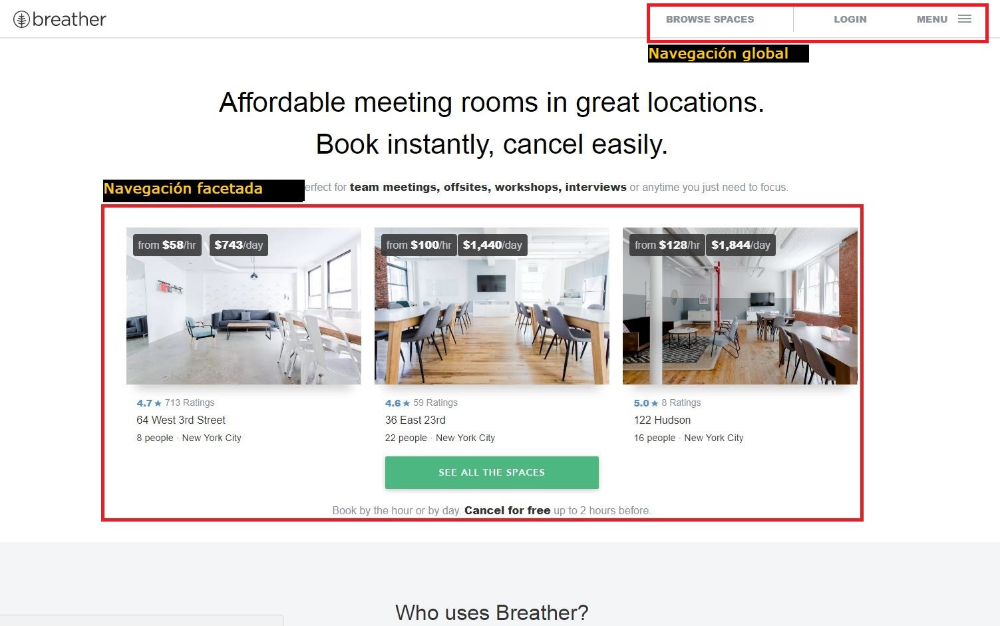
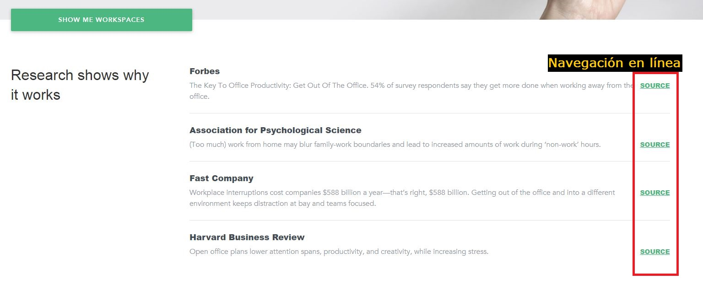
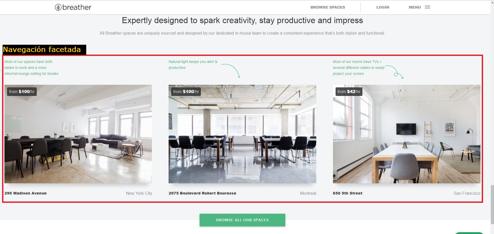
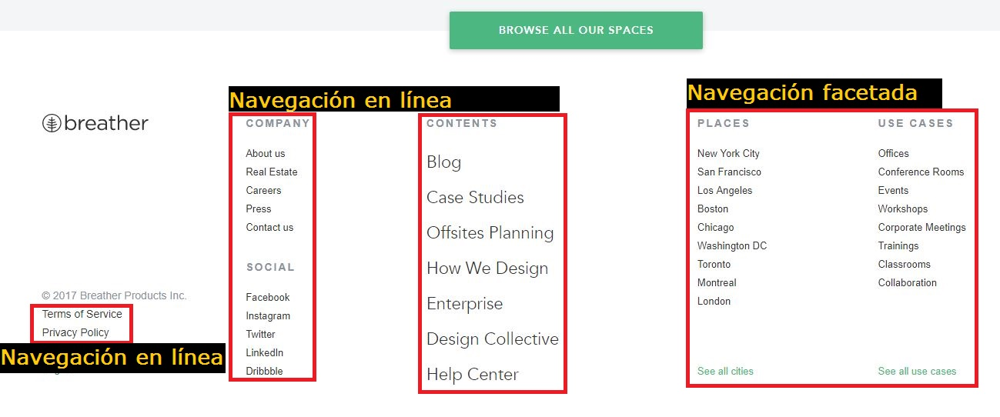
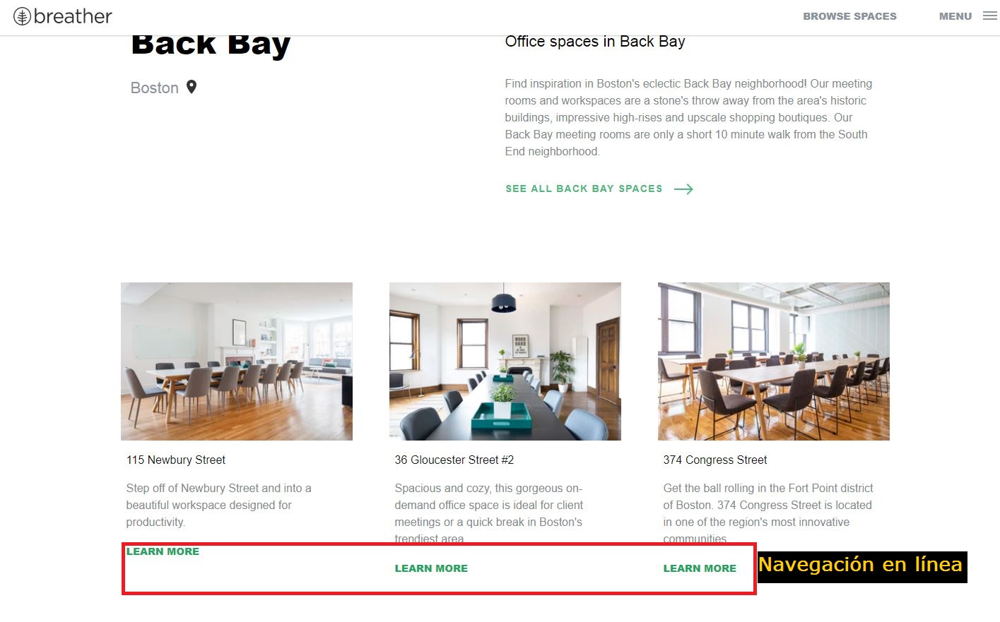
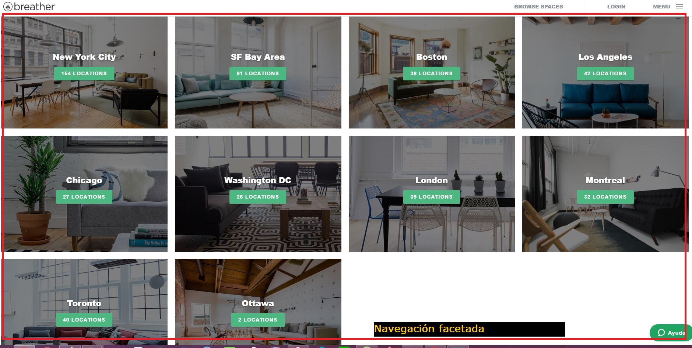
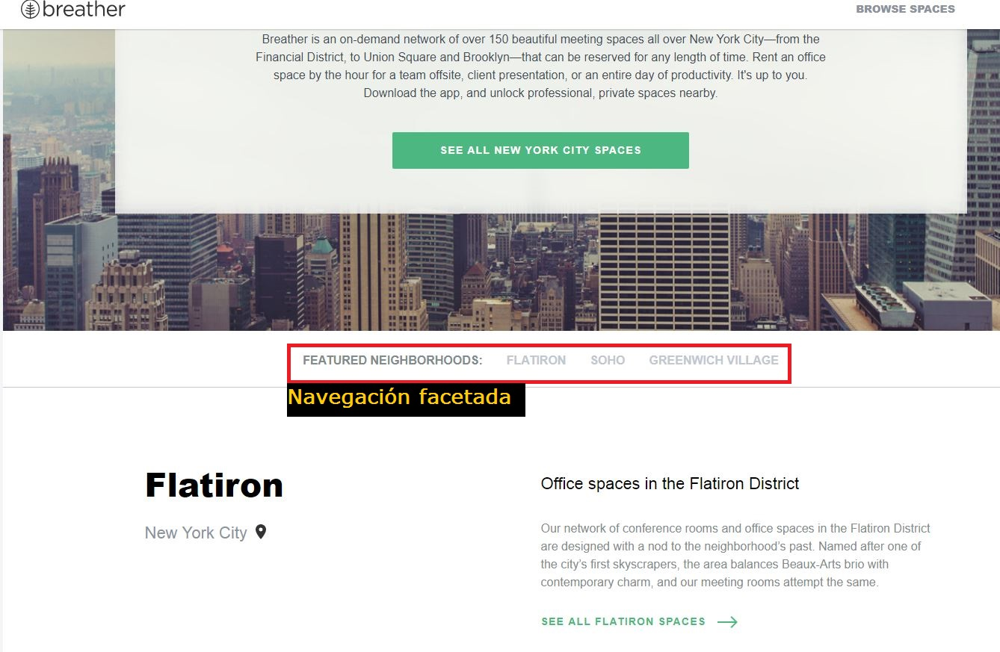
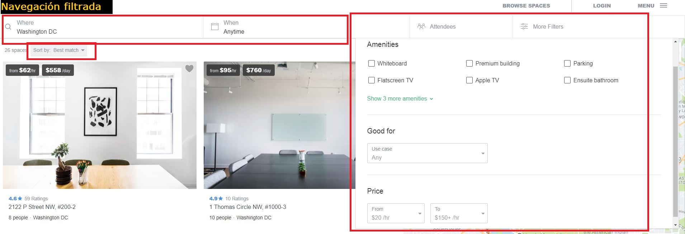

# Indicar los tipos de navegación en tres páginas web

* **Track:** _Common Core_
* **Curso:** _Creando un sitio web interactivo con JavaScript_
* **Unidad:** _Intro a User Experience Design_

## Objetivo
---
El reto consiste en identificar los tipos de navegación de tres páginas web, [Breather](https://breather.com/?version=c "Breather"), [Github](https://github.com/ "Github") y [Medium](https://medium.com/ "Medium").

#### Breather:

#### Github:

#### Medium:

## Contenido

Este proyecto contiene:

1. Un archivo  **`README.md`** que explica el contenido del repositorio.

2. Una carpeta `docs` donde se encuentran las imágenes ejemplares de Breather, Github y Medium en formato **jpg**.

## Autora
Lizbeth Félix Peña

## Fecha
25/11/2017
